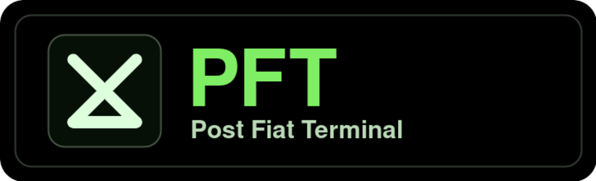

# PFTerminal

<p align="center">
  
</p>

PFTerminal is a crypto-native AI services terminal based on the open-source
Codex CLI. It defaults to Ambient GLM 5.2 and is being built as one secure
terminal interface for AI-assisted coding and crypto-native workflows.

## Install

### Linux

```bash
curl -fsSL https://github.com/agtico/PfTerminal/releases/latest/download/install.sh | sh
```

### macOS

Download the latest DMG from
[GitHub Releases](https://github.com/agtico/PfTerminal/releases/latest):

- `PFTerminal-aarch64-apple-darwin.dmg` for Apple Silicon
- `PFTerminal-x86_64-apple-darwin.dmg` for Intel Macs

Terminal install also works on macOS:

```bash
curl -fsSL https://github.com/agtico/PfTerminal/releases/latest/download/install.sh | sh
```

The installer creates a `pfterminal` command, leaves any stock `codex` command
alone, and stores PFTerminal state in `$HOME/.pfterminal` by default.

## Remove Local Installations

To remove the standalone Linux/macOS install while keeping local credentials,
sessions, and settings:

```bash
rm -f "${PFTERMINAL_INSTALL_DIR:-$HOME/.local/bin}/pfterminal"
rm -rf "${PFTERMINAL_HOME:-$HOME/.pfterminal}/packages/standalone"
```

If you installed the npm package instead:

```bash
npm uninstall -g @agticorp/pfterminal
```

If you installed it with Bun:

```bash
bun remove -g @agticorp/pfterminal
```

To delete all PFTerminal local state as well, including vault credentials,
login state, session history, pane artifacts, and installed packages:

```bash
rm -rf "${PFTERMINAL_HOME:-$HOME/.pfterminal}"
```

## Key Features

- Ambient GLM 5.2 default model path.
- Provider choices for Ambient, Z.AI, OpenRouter, Baseten, Vercel, and OpenAI
  Codex account auth.
- Encrypted `/vault` storage for provider API keys and user credentials.
- Codex-level coding workflows in a local terminal.
- Native pane orchestration for Sauron → Nazgul → Troll → Orc agent workflows.
- Separate PFTerminal home at `$HOME/.pfterminal`, so it does not collide with
  a stock Codex install.
- Planned crypto-native services: authentication, Hyperliquid, GPU rentals,
  staking, borrowing, and related workflows.

## First Run

Launch PFTerminal from the workspace you want it to inspect:

```bash
cd ~/repos
pfterminal
```

For a local workspace where you want PFTerminal to run commands without
approval prompts, launch it with `--yolo`:

```bash
cd ~/repos
pfterminal --yolo
```

`--yolo` bypasses command approvals and sandbox prompts, so use it only in a
workspace where you are comfortable letting the agent read and write files and
run shell commands.

Use:

- `/providers` to add Ambient, Z.AI, OpenRouter, Baseten, Vercel, or OpenAI
  Codex credentials.
- `/vault` to manage encrypted credentials.
- `/model` or `pfterminal -m <model>` to choose a model.
- `/spawn` to create and route multi-agent work.

## Core Slash Commands

Slash commands are typed inside the interactive `pfterminal` chat. PFTerminal
inherits the normal Codex slash commands and adds a few commands for providers,
credentials, panes, spawned agents, and Task Node.

### `/providers`

Use `/providers` when a model or provider needs credentials. It opens the
provider setup menu and stores API keys or account-backed auth in the encrypted
PFTerminal vault.

Common uses:

- Add an Ambient, Z.AI, OpenRouter, Baseten, Vercel, or Anthropic API key.
- Add or refresh OpenAI Codex account auth.
- Check which provider key a selected model expects.

### `/vault`

Use `/vault` to inspect and manage encrypted local credentials. Secrets are
stored under `$HOME/.pfterminal` and are not typed into normal chat history.

Useful forms:

- `/vault` opens the vault action menu.
- `/vault list` lists stored credential labels.
- `/vault show <label>` shows credential metadata without revealing the raw
  secret.
- `/vault credential add` opens a masked entry flow for adding a new secret.

### `/panes`

Use `/panes` to switch between the main Codex conversation, native Codex agent
threads, and Claude Code panes. A pane has its own visible transcript and
running state, so long-running work can continue in one pane while you inspect
another.

The main pane is `Codex Main`. Other panes may be native Codex agent panes or
Claude panes created from the pane picker or through `/spawn`.

### `/spawn`

Use `/spawn` for managed multi-agent work. It can create or bind the hierarchy
PFTerminal uses for larger tasks:

- **Nazgul**: the supervising/root pane.
- **Troll**: a coordinating implementation or review pane.
- **Orc**: a focused worker pane.

Useful forms:

- `/spawn` opens the role picker.
- `/spawn status` shows the current hierarchy, running state, and recent
  dispatches.
- `/spawn nazgul`, `/spawn troll`, and `/spawn orc` create or bind specific
  roles.

Use `/spawn` when you want work split across persistent panes instead of asking
the current chat to do everything in one thread.

## Codex Sessions vs Claude Panes

The default PFTerminal experience is a native Codex session. In that mode,
PFTerminal runs the Codex harness directly: it manages the active model,
tooling, permissions, local context, and command execution in the main terminal
session.

A Claude pane is different. It is a managed Claude Code subprocess wrapped by
PFTerminal through the local exec/pane runner. PFTerminal starts the Claude Code
process, feeds it the task, tracks its output, stores pane artifacts under
`$HOME/.pfterminal/panes`, and shows the result inside the PFTerminal pane UI.

In practice:

- Use native Codex when you want the normal PFTerminal/Codex harness.
- Use a Claude pane when you specifically want Claude Code behavior inside a
  separate, inspectable pane.
- Switching to a Claude pane with `/panes` does not turn the whole terminal into
  Claude. It opens that pane's own subprocess-backed transcript.
- Claude Plan panes use Claude Code's own plan auth. API-key Claude routes use
  keys stored through `/providers` or `/vault`.

## Task Node Quick Guide

`/tasknode` connects PFTerminal to Task Node tasks, rewards, context, and chat.
To use it, you need an account registered on
[tasknode.postfiat.org](https://tasknode.postfiat.org). If you are not
registered there, PFTerminal can open the menu but cannot show your tasks or
submit Task Node actions.

Useful forms:

- `/tasknode` opens the Task Node menu.
- `/tasknode link` starts or refreshes the GitHub-backed Task Node link flow.
- `/tasknode status` shows account, wallet, and task status.
- `/tasknode tasks` lists outstanding Task Node work.
- `/tasknode task <task-id>` opens one task.
- `/tasknode request` starts a personal task request.
- `/tasknode requests` shows active task requests.
- `/tasknode balance` and `/tasknode rewards` show PFT reward state.
- `/tasknode chat` and `/tasknode context` open Task Node chat and context
  surfaces.

Terminal session tokens are stored locally through the encrypted vault. If
linking fails, register or sign in at `https://tasknode.postfiat.org`, then run
`/tasknode link` again.

More setup detail:

- [Install And First Run](docs/install.md)
- [Getting Started](docs/getting-started.md)
- [Authentication And Vault](docs/authentication.md)
- [Configuration](docs/config.md)

## Source Build

```bash
git clone https://github.com/agtico/PfTerminal.git
cd PfTerminal/codex-rs
CARGO_NET_GIT_FETCH_WITH_CLI=true cargo build -p codex-cli --bin pfterminal
```

Then run:

```bash
./target/debug/pfterminal
```

## Upstream

PFTerminal is based on the open-source Codex CLI project. Keep upstream changes
isolated through the `upstream` remote and land PFTerminal changes through this
repository.

This repository is licensed under the [Apache-2.0 License](LICENSE).
